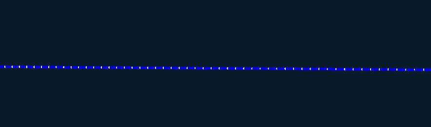
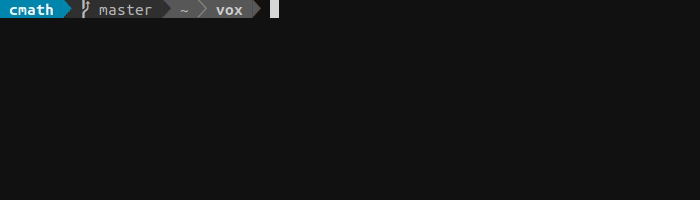
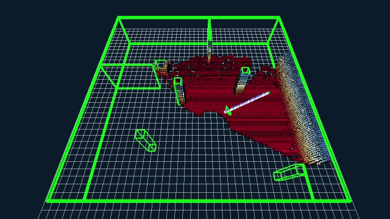
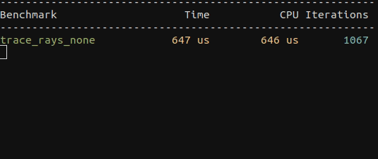

# ``vox::``
`vox::` is a modern robotics development library written in `C++17` with minimal run-time dependencies, featuring efficient 3D volumetric mapping and geometric path planning designed for onboard real-time performance.



---
# Table of Contents  
* [Features](#Features)
    * [Map](#Map)  
        * [Occupancy grid](#Occupancy-grid)
        * [Distance field](#Distance-field)
        * [Serialization](#Serialization)
    * [Planner](#Planner)
        * [Geometric path planning](#Geometric-path-planning)
        * [Local smoothing](#Local-smoothing)
    * [Visualization](#Visualization)
* [Requirements](#Requirements)
    * [Build dependencies](#Build-dependencies)
    * [Run-time dependencies](#Run-time-dependencies)
* [Samples](#Samples)
    * [Basic](#Basic)
    * [Sandbox](#Sandbox)
    * [Simple world](#Simple-world)
    * [Complex world](#Complex-world)
    * [Benchmark](#Benchmark)
* [Tests and microbenchmarks](#Tests-and-microbenchmarks)
* [Files](#Files)

# Features

## Map

Mobile robots need a good representation of the environment to move around without collision. To make an accurate 3D representation and update it dynamically is very compute intensive and only feasible with efficient data access. There is an inherent tradeoff between efficient data storage with respect to size, allowing for compression, and with respect to access times. `vox::Map` is a 3D voxel map designed purposefully to optimize access times without incurring a great overhead cost on storage. It is easy to use:

```c++
vox::Map map;
map.insert(points, pos, att);
```

Inserting depth measurements into the map will update a probabilistic occupancy grid and corresponding distance field, respectively:

```c++
void insert(const Pointcloud& pointcloud, const Eigen::Vector3d& pos, const Eigen::Quaterniond& att){        
    occupancy.insert_pointcloud(pointcloud, pos, att, occupied_keys, free_keys);
    distance.update(occupied_keys, free_keys);
}
```

### Occupancy grid

Depth measurements are inserted into the map and ray traced individually to clear out any free space between the source and the hit point, to map out a boundary between occupied and free space. The map uses a probabilistic occupancy grid to make a robust and accurate estimate of the true state of the environment to accomodate the uncertainty from noisy sensor models. The underlying data structure is a cache-friendly voxel grid implementation designed to optimize for efficient data access to quickly and cheaply update and query the map. 

### Distance field

In practice, the occupancy grid is not enough information to effectively plan a collision-free path. Ideally, a planner can query the map and ask for the minimum distance to the closest obstacle for any given point. `Map` uses the occupancy grid to maintain a distance field and update it iteratively on every pointcloud insertion. The distance field can be queried to make sure any planned path avoids obstacles with a sufficient margin according to the planning objective. From the potential distance field the map lets you easily construct a local gradient field for any given point.

### Serialization
The map uses `boost::serialization` to efficiently serialize the underlying data structure to a binary output stream. It supports iteratively storing and loading only changed parts of the map, allowing for efficient data communication minimizing latency and bandwith usage.

## Planner

Based on the given map, the `vox::Planner` finds the best path to an end state, avoiding collisions with a desired margin of error. This is typically computed continuously every time the map is updated, to always provide the best available path from start to goal and avoid dynamic obstacles. 

```c++
vox::Planner planner;
auto path = planner.plan(map, start, goal);
```

### Geometric path planning

Real-time applications require a very efficient planner to be able to cover a large and complex search space and find a good solution with limited computation power in response to the given time constraints. Sampling-based motion planning methods, like rapidly exploring random trees (*RRT*) propose an effective solution to the planning problem, by reasoning over a finite subset of the entire continuous state space. These tree-based sampling methods begin with the root starting configuration and randomly sample the state space, according to some expansion heuristic. The sample is only connected to the tree if the edge is collision free and the resulting configuration is accepted. 

The [Open Motion Planning Library](https://ompl.kavrakilab.org/index.html) (OMPL) is a state-of-the-art open source implementation of many sampling-based motion planning algorithms. OMPL deliberately does not contain any code related to collision checking but is designed to be integrated with systems providing the necessary functionality. `vox::Planner` integrates OMPL under the hood and overrides two key virtual functions to provide collision checking with a margin of error to *i*) validate the state of a new sample and *ii*) check the connecting edge for collisions before adding it to the growing tree. Fast distance field lookup and ray tracing from `Map` is necessary to ensure effective convergence on a goal state.

```c++
virtual bool isValid(const ob::State* state) const override {
    const auto key = to_key(to_pos(state), map.res);
    return map.distance.get_metric_value(key) >= threshold;
}
```

```c++
virtual bool checkMotion(const ob::State* s1, const ob::State* s2) const override {

    Ray ray;
    ray.origin = to_pos(s1);
    ray.dir = to_pos(s2) - ray.origin;
    ray.dist_left = ray.dir.norm();

    keys.clear();
    trace(ray, map.res, keys);
    for (const auto& key : keys){
        if (map.distance.get_value(key) < threshold){
            return false;
        }
    }

    return true;
}
```

The planner currently employs the OMPL implementation of [Informed RRT*](https://ompl.kavrakilab.org/classompl_1_1geometric_1_1InformedRRTstar.html#gInformedRRTstar) as a backend. It is a geometric planner which only accounts for pure kinematic constraints and not the dynamic feasibility of any proposed path. The current solution serves as a prototype example on how to integrate other OMPL backends, for example control based planners which also take into consideration differential constraints, but is flexible and easily extensible to support other alternative backends as well.


### Local smoothing
After a global path has been found, it might be desirable to locally refine it. The planner supports smoothing a path using the distance field to iteratively move the path away from surrounding obstacles and into free space according to the local gradient. Smoothing results in a more natural and refined path to improve trajectory following, for practically no added computational cost.

## Visualization
To aid in debugging and prototyping during devlopment, `vox::` includes OpenGL-based utilities to visualize occupancy/distance grids. It is an efficient implementation and supports incremental map updates to refresh only the necessary parts of the GPU-representation.


# Requirements

`vox::` is a CPU-only implementation and is designed to run on any GNU/Linux platform. 

## Build dependencies

For the core library, the required dependencies to satisfy at build-time are limited to

* Eigen3
* OMPL
* Boost serialization

A `bootstrap.sh` script is provided to satisfy all build dependencies and quickly get started in a desktop environment. It uses APT for Debain/Ubuntu systems, and is designed to work with AMD64 [Ubuntu 18.04 (LTS)](http://releases.ubuntu.com/18.04/) out of the box. Other distributions might work, but are currently unsupported and untested. Additionally, a prototype [bazel](https://bazel.build/) build environment is provided to quickly build and run sample code on the host platform.



The resulting `libvox.so` and corresponding header files can easily be packaged and installed as a system library. However, due to the embedded nature of most robotics development projects, the recommended workflow is to integrate the source code directly into existing cross development workflows.

## Run-time dependencies

First order dependencies loaded by `libvox.so` at run-time (`readelf -d libvox.so`):

```
Tag                Type                     Name/Value
0x0000000000000001 (NEEDED) Shared library: [libstdc++.so.6]
0x0000000000000001 (NEEDED) Shared library: [libm.so.6]
0x0000000000000001 (NEEDED) Shared library: [libboost_serialization.so.1.65.1]
0x0000000000000001 (NEEDED) Shared library: [libompl.so.15]
0x0000000000000001 (NEEDED) Shared library: [libgcc_s.so.1]
0x0000000000000001 (NEEDED) Shared library: [libc.so.6]
```

Other than standard shared libs linked in by default by the compiler (`libc.so`, `libstdc++.so`, `libm.so`, `libgcc.so`) the first order dependencies are limited to

* `libompl.so`
* `libboost_serialization.so`

Including secondary dependencies, the full transitive closure of shared libraries needed to be satisfied at run-time include:

* `libompl.so`
* `libpthread.so`
* `libboost_system`
* `libboost_filesystem`
* `libboost_serialization.so`

For cross development it is recommended to make available cross packages during build of at least first-order dependencies to resolve undefined symbols at link-time and defer resolution of secondary dependencies to load-time (i.e: `-Wl,--unresolved-symbols=ignore-in-shared-libs`).


# Samples

In order to demonstrate some of the features of `vox::`, source code for a few sample programs are included. They can be expanded on, or simply used as guidance when incorporating the visualization of a map in another program. One of the samples is also used as a benchmark for performance to give an indication of average time for updating the map with a semi-realistic pointcloud.

## Basic

```
$ bazel run samples/0_basic
```
This sample program does not contain any visualization, and serves as a minimal example of how to use `vox::`. The main function is included below.

```c++
int main(int argc, char* argv[]){

    // Create a map
    vox::Map map;

    // Create a fake pointcloud
    const Eigen::Vector3d sensor_pos(0.0, 0.0, 0.0);
    const Eigen::Quaterniond sensor_att = Eigen::Quaterniond::Identity();
    const auto sensor_max_range = 20.0;
    const auto pointcloud = get_pointcloud(sensor_pos, sensor_att, sensor_max_range);

    // Set a few parameters
    const auto min_return_range = 0.0;                      // [m] discard measurement shorter than this
    const auto max_return_range = sensor_max_range;         // [m] treat measurements above this range as no-return
    const auto no_return_free_range = 0.5*sensor_max_range; // [m] no-return measurements will free this much

    // Insert pointcloud in map
    map.insert(pointcloud, sensor_pos, sensor_att, min_return_range, max_return_range, no_return_free_range);

    // Create a planner with default parameters
    vox::Planner planner(vox::Planner::Parameters{});

    // Plan a path
    const Eigen::Vector3d start(10.0, -10.0, 2.0);
    const Eigen::Vector3d goal(10.0, 10.0, 2.0);
    auto path = planner.plan(map, start, goal);

    return 0;
}
```


## Sandbox
```
$ bazel run samples/1_sandbox
```
This sample program incorporates visualization and a window context, using OpenGL and [GLFW](https://www.glfw.org/). The user controls the viewpoint using the mouse and W,A,S,D keys, when pressing the left mouse button. Using the space-key, the user is able to insert a dummy pointcloud. This samples also allow the user to set the start and goal positions used for path planning, allowing an interactive test environment for map manipulation and path planning.


## Simple world

```
$ bazel run samples/2_simple_world
```
This sample extends the previous sample, adding a mock robot with a depth camera, allowing the user to set the goal position by pressing G. The dummy pointcloud is now generated by ray tracing from the depth sensor, and into an environment consisting of boxes. Normally distributed noise is also added to the depth measurements, to somewhat resemble real data. Whenever a valid path is found, the robot moves along it towards the goal.


## Complex world

```
$ bazel run samples/3_complex_world
```
This sample showcases the same features as the previous sample, but with added complexity in the environment. In addition, the robot travels between a set of predetermined goal points, in random order. The environment is completely enclosed, but the visualization of the roof is disabled for easier inspection. For added complexity, the boxes in the environment will randomly appear and disappear whenever the goal is reached. This makes freeing of previously occupied voxels necessary.




## Benchmark

```
$ bazel run samples/4_benchmark
```
This sample is simply the previous sample, only without visualization, running for a predetermined number of iterations (equivalent to 60 secs of the previous sample). The map update (occupancy grid update with subsequent distance field update) and path planning operations are instrumented with timers, so that an average time for each operation can be calculated. The average map update time per ray traced distance is also calculated. This benchmark is meant to give an indication as to what kind of performance to expect on a given platform. 

Below are the results of running the benchmark on a reasonably new desktop machine, as well as the NVIDIA Jetson TX2. Keep in mind that **`vox::` utilizes a single CPU core.**

Platform | Map update per point | Map update per distance | Path planning
--- | --- | --- | ---
Desktop | 1.21 us | 148 ns/m | 261 us
TX2 | 3.77 us | 434 ns/m | 958 us

These numbers depend on many variables, such as the maximum trace distance (with regards to the voxel size) and the geometry of the pointcloud (due to block caching). The map update time is approximately linear in the number of points inserted, and in the average distance they must be traced. Although dense pointclouds will get some speed-up (since multiple points will hit the same voxel and only result in one traced ray) the number of points inserted is best kept as low as possible. The depth sensor in this sample yields scans with 8192 points. If a depth sensor outputs a large number of points, some preprocessing steps may be required to reduce the number. This may be benificial in any case, as some of the dense pointclouds from e.g. stereo camera solutions contain points with highly correlated errors anyway.

# Tests and microbenchmarks

`vox::` contains a number of unit tests and microbenchmarks. The unit tests are written with the help of [Catch2](https://github.com/catchorg/Catch2), and the microbenchmarks use [googlebenchmark](https://github.com/google/benchmark). In contrast to the benchmark sample, the microbenchmarks serve only as relative measures of performance, and are really only useful when working under the hood of `vox::`. As an example, choosing the right block size (statically set as `vox::Map::K`) on a new platform is easier after running
```bash
$ bazel run tests/benchmark:trace
```


# Files
```bash
$ tree vox/ tests/ samples/
vox
├── core
│   ├── Block.h
│   ├── Grid.h
│   └── Key.h
├── mapping
│   ├── DistanceGrid.h
│   ├── Map.h
│   ├── OccupancyGrid.h
│   ├── Ray.h
│   ├── serialization.cc
│   ├── serialization.h
│   ├── trace.cc
│   └── trace.h
└── planning
    ├── Path.cc
    ├── Path.h
    ├── PeriodicEvent.cc
    ├── PeriodicEvent.h
    ├── Planner.cc
    ├── Planner.h
    ├── Refiner.cc
    ├── Refiner.h
    ├── Solver.cc
    ├── Solver.h
    ├── Validator.cc
    └── Validator.h
tests
├── benchmark
│   ├── grid_access.cc
│   ├── hashing.cc
│   ├── key_functions.cc
│   ├── map.cc
│   └── trace.cc
└── unit
    ├── catch.hpp
    └── tests.cc
samples
├── 0_basic
│   └── main.cc
├── 1_sandbox
│   └── main.cc
├── 2_simple_world
│   └── main.cc
├── 3_complex_world
│   └── main.cc
├── 4_benchmark
│   └── main.cc
└── utils
    ├── drawers
    │   ├── DistanceGridDrawer.cc
    │   ├── DistanceGridDrawer.h
    │   ├── EnvironmentDrawer.cc
    │   ├── EnvironmentDrawer.h
    │   ├── LineDrawer.cc
    │   ├── LineDrawer.h
    │   ├── Line.h
    │   ├── PathDrawer.cc
    │   ├── PathDrawer.h
    │   ├── PointDrawer.cc
    │   ├── PointDrawer.h
    │   ├── Point.h
    │   ├── RobotDrawer.cc
    │   ├── RobotDrawer.h
    │   ├── Shader.cc
    │   ├── Shader.h
    │   ├── TextDrawer.cc
    │   └── TextDrawer.h
    ├── eigen.h
    ├── gui
    │   ├── CameraPose.cc
    │   ├── CameraPose.h
    │   ├── window.cc
    │   └── window.h
    ├── misc.cc
    ├── misc.h
    ├── opengl
    │   ├── glad.cc
    │   ├── glad.h
    │   └── khrplatform.h
    ├── Resource.h
    ├── Scopeguard.h
    ├── tests
    │   ├── catch.hpp
    │   ├── main.cc
    │   ├── resource.cc
    │   └── scopeguard.cc
    ├── Timer.cc
    ├── Timer.h
    └── world
        ├── Box.h
        ├── Environment.cc
        ├── Environment.h
        ├── Robot.cc
        ├── Robot.h
        ├── Sensor.cc
        └── Sensor.h
```
